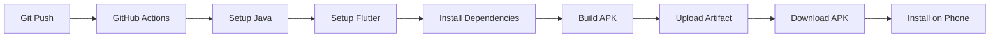

# GitHub Actions APK Build - Quick Guide

## 🎯 Ziel
Automatischer APK Build bei jedem Git Push → APK Download von GitHub → Installation auf Handy

---

## 📋 Voraussetzungen

✅ Git installiert (bereits erledigt)
✅ GitHub Account
✅ Firebase Projekt erstellt
✅ `google-services.json` heruntergeladen

---

## 🚀 Schritt-für-Schritt Anleitung

### Schritt 1: GitHub Repository erstellen (2 Min)

1. Gehe zu: **https://github.com/new**
2. Repository Name: `KalorienTracker`
3. Wähle: **Public** (oder Private, deine Wahl)
4. ⚠️ **WICHTIG**: Haken bei README, .gitignore, license NICHT setzen!
5. Klicke **"Create repository"**

---

### Schritt 2: Code zu GitHub pushen (3 Min)

Führe aus:
```powershell
# Git Setup Script ausführen
.\setup_github.ps1

# Dann (ersetze YOUR_USERNAME mit deinem GitHub Nutzernamen):
git remote add origin https://github.com/YOUR_USERNAME/KalorienTracker.git
git branch -M main
git push -u origin main
```

Beim ersten Push wirst du nach GitHub Login gefragt - einfach einloggen!

---

### Schritt 3: Firebase Secrets einrichten (5 Min)

#### 3.1 Google Services JSON vorbereiten

1. **Falls noch nicht vorhanden**: Firebase Console → Projekt → Projekteinstellungen → Android App → `google-services.json` herunterladen
2. Öffne `google-services.json` in einem Text-Editor
3. **Kompletten Inhalt kopieren** (Strg+A, Strg+C)

#### 3.2 Secret in GitHub eintragen

1. Gehe zu: `https://github.com/YOUR_USERNAME/KalorienTracker/settings/secrets/actions`
2. Klicke **"New repository secret"**
3. Name: `GOOGLE_SERVICES_JSON`
4. Value: **Füge den kompletten JSON-Inhalt ein**
5. Klicke **"Add secret"**

#### 3.3 Firebase Options (optional, für später)

Wenn du `firebase_options.dart` hast:
1. Wieder **"New repository secret"**
2. Name: `FIREBASE_OPTIONS`
3. Value: Kompletten Inhalt von `firebase_options.dart`
4. **"Add secret"**

---

### Schritt 4: APK Build starten (1 Min)

#### Option A: Automatisch (bei jedem Push)
```powershell
# Einfach Code ändern und pushen:
git add .
git commit -m "Update code"
git push

# → GitHub Actions baut automatisch APK!
```

#### Option B: Manuell triggern
1. Gehe zu: `https://github.com/YOUR_USERNAME/KalorienTracker/actions`
2. Wähle Workflow: **"Build Android APK"**
3. Klicke **"Run workflow"** (rechts)
4. Branch: **main**
5. Klicke **"Run workflow"** (grüner Button)

---

### Schritt 5: Build Status beobachten (5-10 Min)

1. Der Workflow Run startet (gelber Punkt)
2. Warte ca. 5-10 Minuten
3. Erfolg = grüner Haken ✅
4. Fehler = rotes X ❌ (dann Logs prüfen)

---

### Schritt 6: APK herunterladen (1 Min)

1. Klicke auf den **erfolgreichen Workflow Run**
2. Scrolle runter zu **"Artifacts"**
3. Klicke auf **"kalorientracker-app"** → Download ZIP
4. Entpacke ZIP → `app-release.apk`

---

### Schritt 7: APK auf Handy installieren (2 Min)

#### Methode A: USB Kabel
1. Kopiere `app-release.apk` auf Handy
2. Öffne Datei-Manager auf Handy
3. Tippe auf `app-release.apk`
4. "Aus unbekannten Quellen installieren" erlauben
5. **Installieren** ✅

#### Methode B: Cloud/Email
1. Lade APK in Google Drive / OneDrive hoch
2. Öffne auf Handy
3. Download APK
4. Installieren wie oben

#### Methode C: QR Code
1. Nutze: https://www.qr-code-generator.com
2. Upload APK → QR Code generieren
3. Mit Handy scannen → Download → Installieren

---

## 🔧 Troubleshooting

### Problem: "Build failed"

**Check 1: google-services.json Secret korrekt?**
```
GitHub → Settings → Secrets → GOOGLE_SERVICES_JSON vorhanden?
```

**Check 2: Workflow File korrekt?**
```
.github/workflows/build-apk.yml muss existieren
```

**Check 3: Logs prüfen**
```
GitHub Actions → Failed Run → Logs anschauen
```

### Problem: "Secrets not found"

→ Secret-Name muss **exakt** `GOOGLE_SERVICES_JSON` sein (Groß-/Kleinschreibung beachten!)

### Problem: "APK installation blocked on phone"

→ Einstellungen → Sicherheit → "Unbekannte Quellen" für jeweilige App (Chrome, Dateien, etc.) aktivieren

### Problem: "App crashes on start"

→ Firebase nicht richtig konfiguriert. Prüfe:
- `google-services.json` im GitHub Secret korrekt?
- Firebase Projekt aktiv?
- Cloud Functions deployed?

---

## 📊 Was passiert bei GitHub Actions?



---

## ⚡ Zusammenfassung

| Schritt | Dauer | Was passiert |
|---------|-------|--------------|
| 1. GitHub Repo erstellen | 2 Min | Repository auf GitHub anlegen |
| 2. Code pushen | 3 Min | Projekt auf GitHub hochladen |
| 3. Secrets einrichten | 5 Min | Firebase Config hinterlegen |
| 4. Build triggern | 1 Min | APK Build starten |
| 5. Warten | 10 Min | GitHub baut APK |
| 6. APK download | 1 Min | Fertige APK herunterladen |
| 7. Installation | 2 Min | APK auf Handy installieren |
| **TOTAL** | **~25 Min** | **Fertige App auf Handy!** ✅ |

---

## 🎯 Nächste Schritte nach erstem Build

### Automatische Updates einrichten:
```powershell
# Code ändern
# Dann:
git add .
git commit -m "Add new feature"
git push

# → GitHub baut automatisch neue APK!
# → Download und auf Handy installieren (überschreibt alte Version)
```

### Release Tags erstellen:
```powershell
git tag v1.0.0
git push --tags

# → APK erscheint unter GitHub Releases
# → Direkter Download-Link für Nutzer
```

### Beta Tester einladen:
- Repository auf Public stellen
- Download-Link teilen: `https://github.com/YOUR_USERNAME/KalorienTracker/releases/latest`
- Nutzer können APK direkt herunterladen

---

## 📱 Fertige App Features

Nach Installation hast du eine voll funktionsfähige App mit:

✅ Google Sign-In
✅ Email/Password Login & Registration
✅ AI Food Analysis (Gemini)
✅ Barcode Scanner
✅ Daily Calorie Tracking
✅ Favorites Management
✅ Real-time Sync (Firestore)

---

## 🆘 Hilfe benötigt?

**GitHub Actions Logs prüfen:**
`https://github.com/YOUR_USERNAME/KalorienTracker/actions`

**Firebase Console:**
`https://console.firebase.google.com`

**Dokumentation:**
- `START_HERE.md` - Übersicht
- `DEVELOPER.md` - Technische Details
- `SETUP_GUIDE.md` - Deployment

---

Viel Erfolg! 🚀
